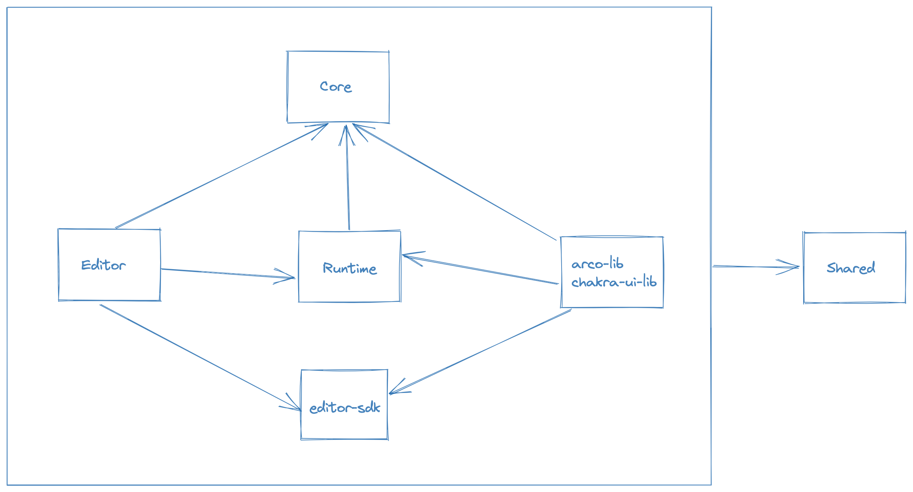

<div align="center">
  
</div>
<div align="center">
  <h1>Sunmao</h1>
</div>

<p align="center">
  
  <a href="https://github.com/webzard-io/sunmao-ui/issues">
    
  </a>
  
</p>
Sunmao is a front-end low-code framework. Through Sunmao, you can easily encapsulate any front-end UI components into low-code component libraries, so as to build your own low-code UI development platform, making front-end development as tight as Sunmao.

[中文](./docs/zh/README.md)

## Why Sunmao?

### Responsive low-code framework

Sunmao chooses a responsive solution that is easy to understand and has excellent performance, making Sunmao intuitive and quick to use.

### Powerful low-code GUI editor

Sunmao has a built-in GUI editor, which almost includes all the capabilities that a complete low-code editor should have.

### Strong extensibility

Both the UI component library itself and the low-code editor support custom extensions. Developers can register various components to cover application requirements and continue to use the existing visual design system.

### Type Safety

You are in type safety both when developing Sunmao components and when using the Sunmao editor. Sunmao heavily uses Typescript and JSON schema for a great type system.

For more details, read [Sunmao: A truly extensible low-code UI framework](./docs/en/what-is-sunmao.md).

## Directory Structure

Sunmao is a monorepo project that includes the following packages:

| Name          | Description                                                                                 |
| ------------- | ------------------------------------------------------------------------------------------- |
| core          | Spec type definition of Sunmao                                                              |
| runtime       | Sunmao's runtime                                                                            |
| editor        | Sunmao's GUI editor                                                                         |
| editor-sdk    | sdk for Sunmao Editor                                                                       |
| shared        | Types and utility functions shared by each package of the Sunmao project                    |
| chakra-ui-lib | [chakra-ui](https://chakra-ui.com/) component library packaged by Sunmao                    |
| arco-lib      | [arco-design](https://arco.design/) component library packaged by Sunmao (recommend to use) |



## local development

### Start

```sh
yarn
cd packages/editor
yarn dev
```

### Test

```shell
yarn test:ci
```

### Build

```shell
yarn
```

> When you run the runtime or editor locally, if you modify the code of other packages, you must rebuild the modified package, otherwise, the runtime and editor will still run the old code.

## Tutorial

Sunmao users are divided into two roles, one is a developer and the other is a user.

The responsibilities of developers are similar to those of common front-end developers. They are responsible for developing UI components and encapsulating common UI components to Sunmao components. Developers need to write code to implement the logic of the component.

The user's responsibility is to use the Sunmao components encapsulated by developers to build front-end applications in the Sunmao low-code editor. Users do not need front-end knowledge and programming skills. They can complete application construction only through UI interaction.

We have prepared two tutorials for different roles. The user only needs to read the user's tutorial, but the developer has to read both.

- [User's Tutorial](./docs/en/user.md)
- [Developer's Tutorial](./docs/en/developer.md)

## Online Demo

[Sunmao Playground](https://sunmao-ui-cloud.vercel.app)

## License

MIT
